# Lifted-RPI: GPU-Accelerated Robust Positively Invariant Sets

[](https://www.python.org/downloads/)
[](LICENSE)
[](https://developer.nvidia.com/cuda-toolkit)
[](https://doi.org/10.1109/LCSYS.2025.3641128)

Official implementation of the paper:

> **A. Ramadan and S. Givigi**, "Learning-Based Shrinking Disturbance-Invariant Tubes for State- and Input-Dependent Uncertainty," *IEEE Control Systems Letters*, vol. 9, pp. 2699-2704, 2025.
>
> **DOI:** [10.1109/LCSYS.2025.3641128](https://doi.org/10.1109/LCSYS.2025.3641128)
> **IEEE Xplore:** [https://ieeexplore.ieee.org/document/11278656](https://ieeexplore.ieee.org/document/11278656)

## Overview

This package computes robust positively invariant (RPI) sets for discrete-time LTI systems with state- and input-dependent disturbances using the lifted operator framework described in the paper above. The core algorithm performs an outside-in fixed-point iteration in a lifted space with GPU-accelerated Minkowski sums and point-cloud clipping. No vertex enumeration (H-to-V conversion) is needed.

### Features

- GPU-accelerated Minkowski sums via JAX + CuPy with zero-copy DLPack transfers
- Gaussian-Process-learned disturbance graph sets with credible-ellipsoid outer bounds
- Configurable convergence metrics (Hausdorff, support function, AABB volume)

## Repository Structure

```
lifted-rpi/
├── pyproject.toml                  # Package metadata & dependencies
├── README.md
├── .gitignore
├── scripts/
│   ├── run_pipeline.py             # End-to-end pipeline (reproduces paper results)
│   ├── generate_figures.py         # Publication-quality figure generator
│   ├── generate_speedup_figure.py  # Baseline vs surrogate comparison
│   └── generate_cpu_vs_gpu_figure.py  # CPU vs GPU comparison
├── results/
│   ├── G_learned.joblib            # Pre-trained GP disturbance model
│   ├── pipeline_paper_exact.npz    # Saved Z*, metrics, timing
│   └── figures/                    # Generated figures (PDF + PNG)
└── src/
    └── lifted_rpi/
        ├── __init__.py             # Public API re-exports
        ├── polytope.py             # H-representation polytope (Ax <= b)
        ├── minkowski_gpu.py        # JAX + CuPy GPU Minkowski sum + filtering
        ├── vset.py                 # VSet vertex-cloud, GraphSet, box_corners
        ├── engine.py               # LiftedSetOpsGPU_NoHull, core lifted operator
        ├── disturbance.py          # Analytical drag disturbance model
        ├── convergence.py          # Hausdorff, support function, AABB volume
        ├── gp_learner.py           # GP-based learned disturbance graph set
        ├── iteration.py            # Fixed-point iterator (outside-in)
        ├── initialization.py       # Z0, W, DeltaV construction helpers
        ├── simulation.py           # MPC simulation, epsilon-MRPI, trajectory gen
        ├── speedup/                # Surrogate + GPU acceleration (228x speedup)
        │   ├── __init__.py
        │   ├── surrogate.py        # SurrogateGraphSet, Nystroem & Poly builders
        │   ├── gpu_ops.py          # PyTorch CUDA: unique, knn, nystroem, hausdorff
        │   └── README.md           # Mathematical analysis & benchmarks
        └── plotting/
            ├── __init__.py
            ├── publication.py      # IEEE-style matplotlib figures
            ├── convergence_plots.py  # 3D convergence triplets
            ├── gp_analysis.py      # GP uncertainty visualisation
            ├── hull_3d.py          # Plotly 3D convex-hull viewer
            └── interactive.py      # Plotly + HTML interactive explorer
```

## Installation

### Requirements

- Python >= 3.9
- NVIDIA GPU with CUDA 12 (for GPU acceleration)
- ~2 GB VRAM (for the double-integrator example)

### Install from source

```bash
# Clone the repository
git clone https://github.com/TheLastPixie/lifted-rpi.git
cd lifted-rpi

# Create a virtual environment (recommended)
python -m venv .venv
.venv\Scripts\activate        # Windows
# source .venv/bin/activate   # Linux / macOS

# Install the package in editable mode
pip install -e ".[all]"
```

### Install dependencies manually

```bash
# Core dependencies
pip install numpy scipy matplotlib plotly scikit-learn joblib

# GPU acceleration (requires CUDA 12)
pip install "jax[cuda12]" cupy-cuda12x

# Optional: polytope operations
pip install "pycddlib<3"
pip install git+https://github.com/haudren/pytope.git
```

### Google Colab

```python
# Install in a Colab cell (T4/A100 runtime required)
!pip install jax[cuda12] cupy-cuda12x plotly scikit-learn joblib
!pip install "pycddlib<3"
!pip install git+https://github.com/haudren/pytope.git
!pip install git+https://github.com/TheLastPixie/lifted-rpi.git
```

## Results

The pipeline converges in **59 iterations** producing robust positively invariant sets for the 2D double-integrator system with state-dependent drag disturbance. Three acceleration tiers are available:

| Mode | Total time | Per-iteration | Frequency | Speedup |
|------|-----------|---------------|-----------|---------|
| Baseline (raw GP) | 979.2 s | 17.2 s | 0.06 Hz | 1x |
| CPU Surrogate (Nystroem) | 42.7 s | 0.72 s | 1.4 Hz | 23x |
| GPU Surrogate (RTX 4070S) | 4.3 s | 0.073 s | **13.8 Hz** | **228x** |

### Convergence

<p align="center">
  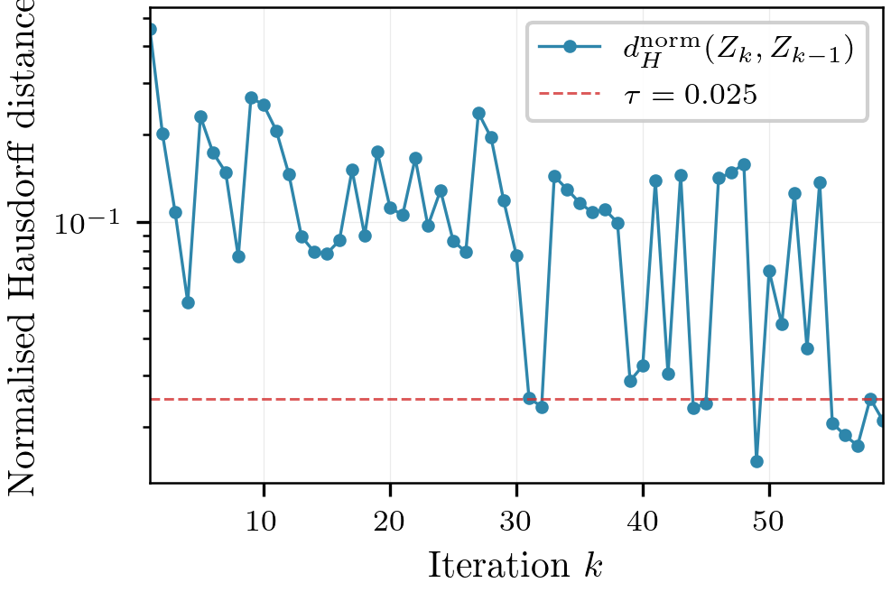
  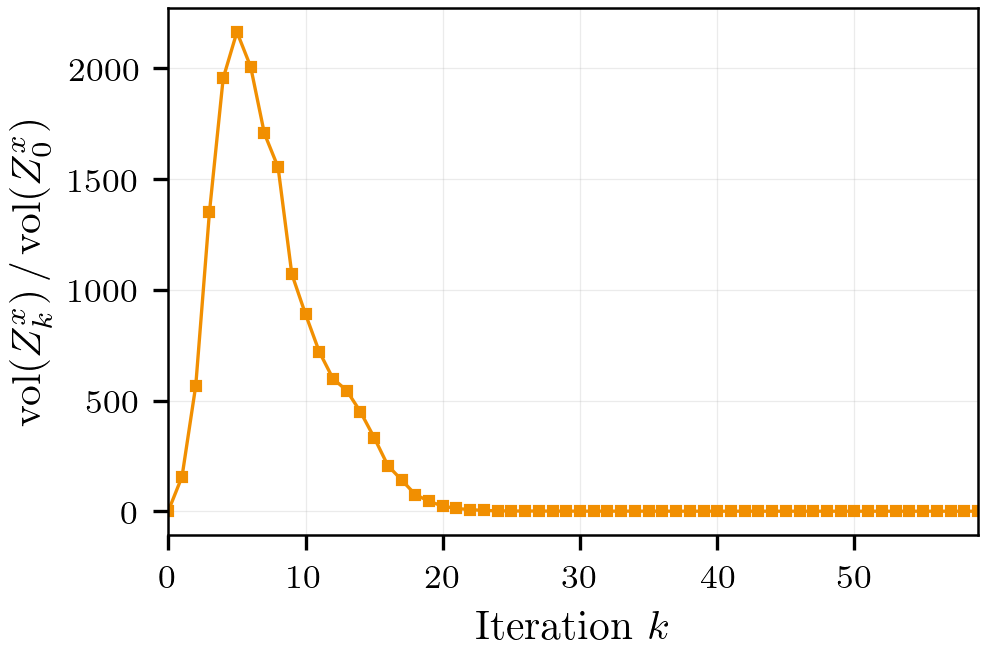
</p>

Left: normalised Hausdorff distance between successive iterates (tolerance 2.5e-2, patience 5). Right: normalised AABB volume of the state projection across iterations.

### 3D Convergence Evolution

The following figures show the outside-in convergence from the initial set Z0 through intermediate iterates to the fixed-point Z* for velocity, control and disturbance coordinates.

<p align="center">
  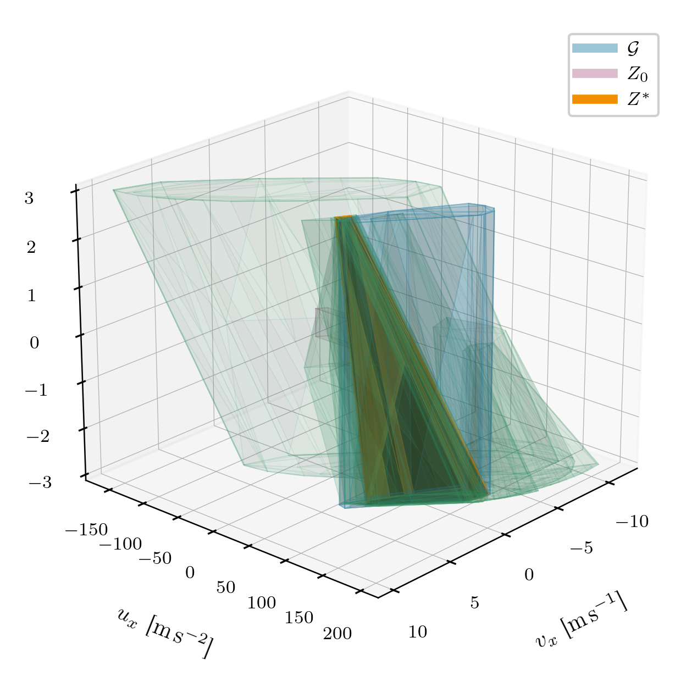
  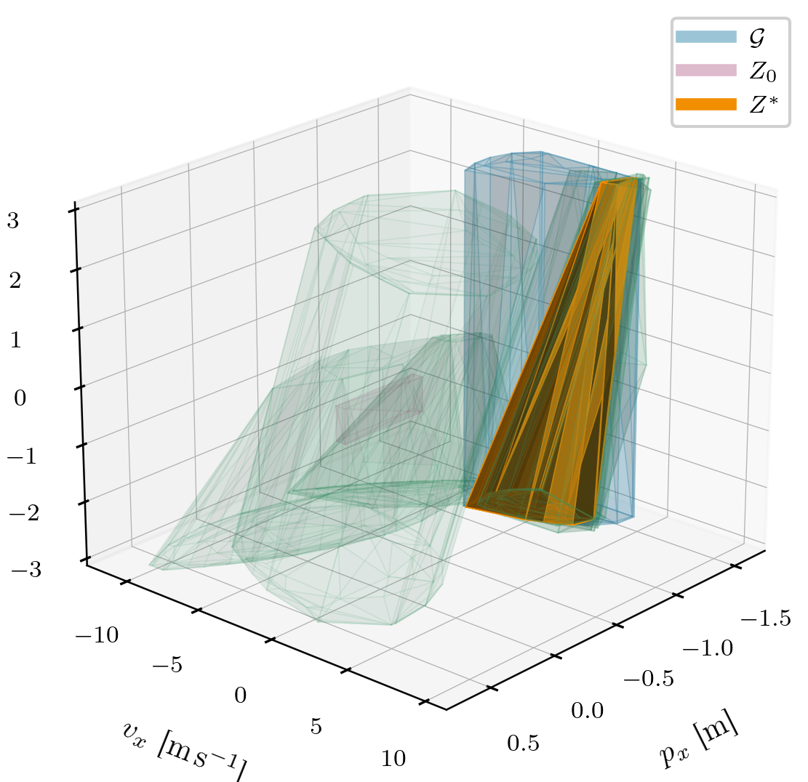
</p>

### GP-Learned Disturbance Analysis

<p align="center">
  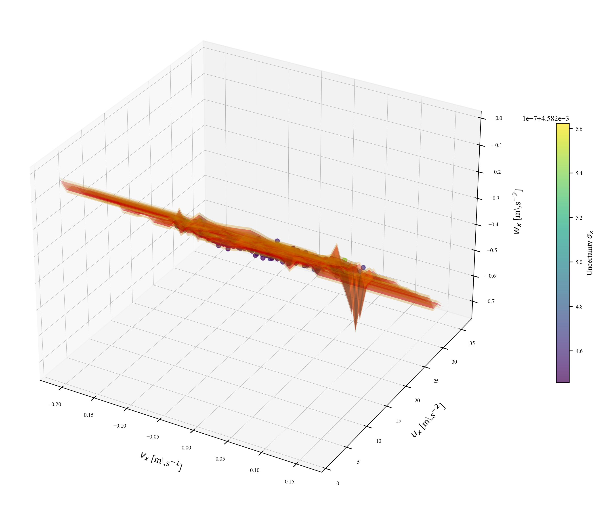
  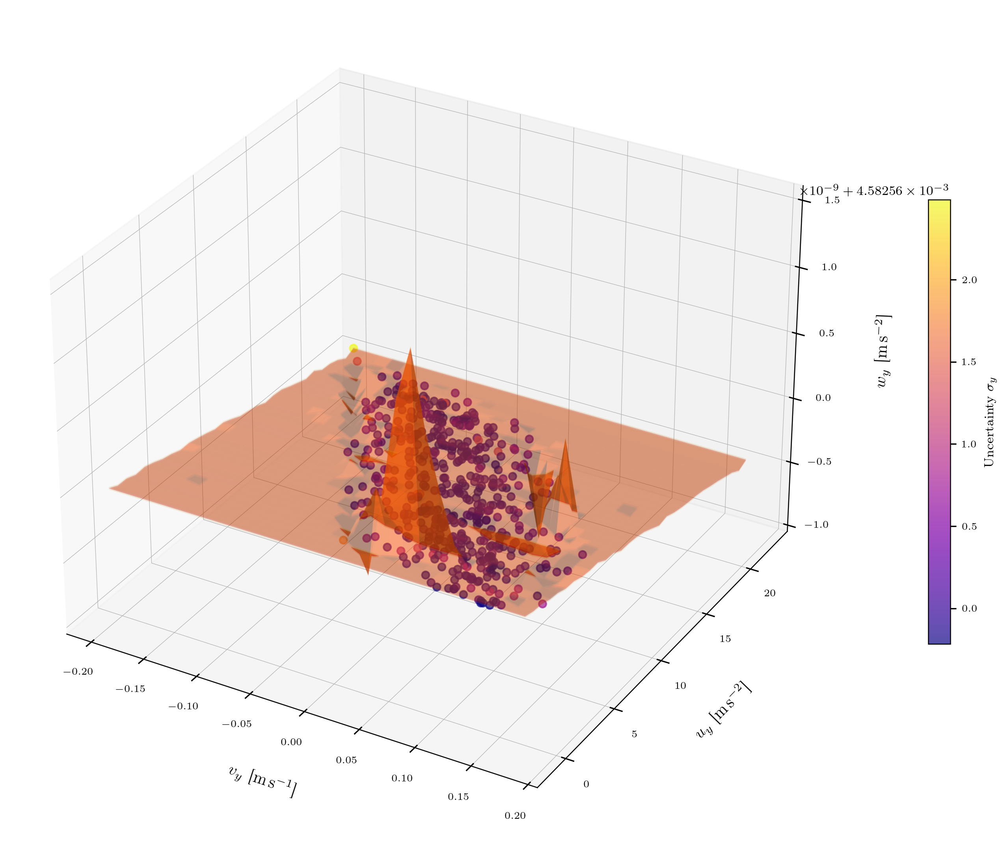
</p>

<p align="center">
  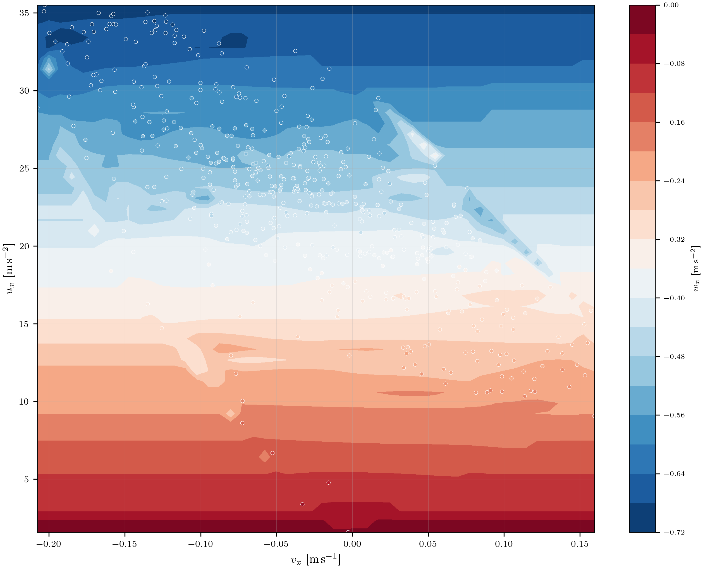
  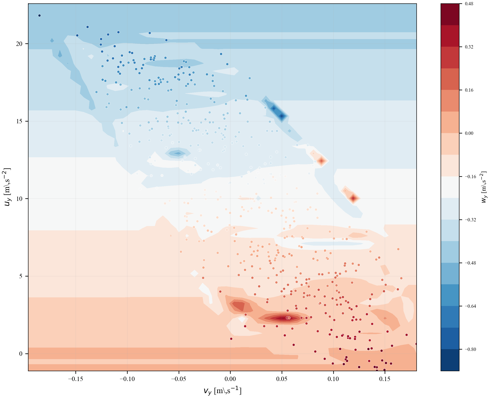
  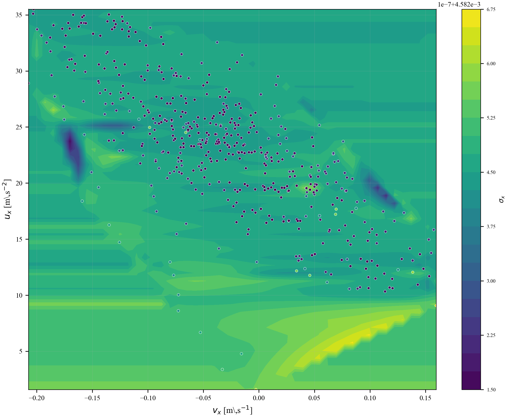
</p>

Top: 3D scatter of MPC simulation trajectories with GP mean surface and 95% confidence bounds. Bottom: 2D contourf heatmaps of predicted disturbance and uncertainty.

### Acceleration: Baseline vs Surrogate

<p align="center">
  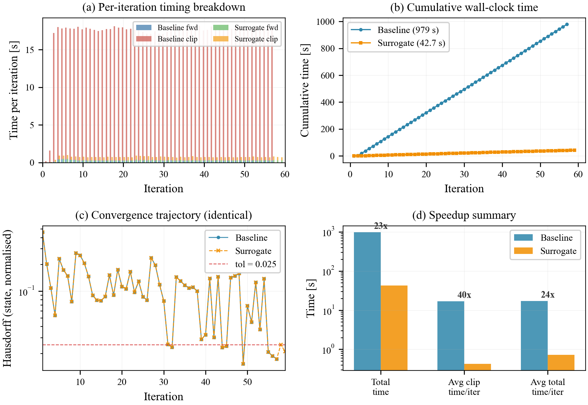
</p>

The raw GP clipping (baseline) spends 98.6% of wall-clock time inside `sklearn.GaussianProcessRegressor.predict`, computing 50k x 2500 pairwise kernel matrices that are ultimately a no-op (100% of points fall back to the prior box). The Nystroem surrogate replaces this with a 200-component RBF approximation fitted in < 1 s, yielding a **23x total speedup** with bitwise-identical output. See [`src/lifted_rpi/speedup/README.md`](src/lifted_rpi/speedup/README.md) for the full mathematical analysis.

### Acceleration: CPU vs GPU

<p align="center">
  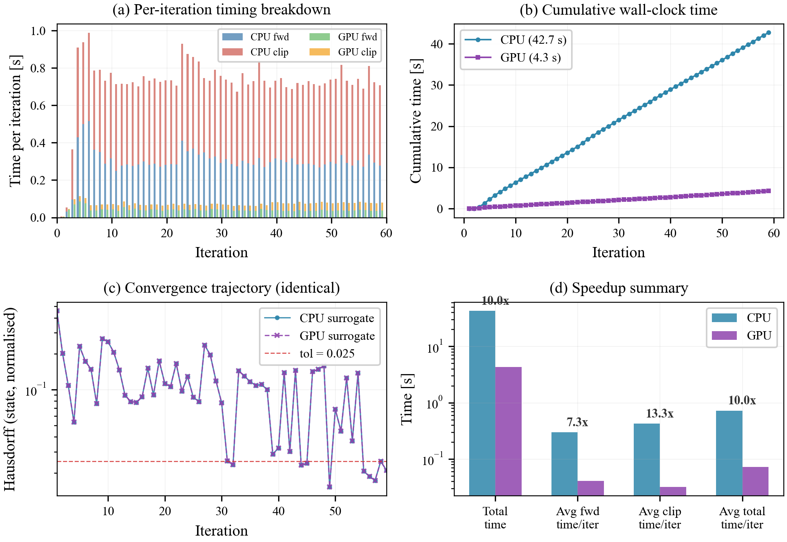
</p>

GPU acceleration (PyTorch CUDA) replaces NumPy `unique`, SciPy `KDTree` and Nystroem transform with batched `torch.cdist` and `torch.unique` on GPU, achieving a further **10x speedup** over the CPU surrogate (13.8 Hz vs 1.4 Hz).

### Reproducing These Figures

```bash
# Option 1: Generate figures from the pre-computed results (< 30 s)
python scripts/generate_figures.py --save-dir results/figures

# Option 2: Re-run the full pipeline from scratch, then generate figures
python scripts/run_pipeline.py --surrogate nystroem
python scripts/generate_figures.py --save-dir results/figures

# Generate comparison figures
python scripts/generate_speedup_figure.py       # baseline vs surrogate
python scripts/generate_cpu_vs_gpu_figure.py     # CPU vs GPU
```

All figures are saved as both PDF (publication) and PNG (preview) in `results/figures/`.

## Quick Start

### Reproduce paper results

```bash
# Full pipeline: train GP -> build Z0 -> fixed-point iteration -> save results
python scripts/run_pipeline.py

# Reuse pre-trained GP model (faster, skips MPC simulation + GP training)
python scripts/run_pipeline.py --gp-model results/G_learned.joblib

# Use analytical drag model instead of GP
python scripts/run_pipeline.py --graphset analytical

# Generate publication figures from saved results
python scripts/generate_figures.py --save-dir results/figures
```

### Use as a library

```python
import numpy as np
from lifted_rpi import (
    LiftedSetOpsGPU_NoHull, VSet, box_corners,
    fixed_point_reach, make_drag_graphset,
    build_Z0_inside_G, make_W_from_learned_G_envelope, make_DV_from_u_box,
)

# 1. Define system matrices (double integrator, dt=0.02)
dt = 0.02
A = np.array([[1, dt, 0, 0], [0, 1, 0, 0], [0, 0, 1, dt], [0, 0, 0, 1]])
B = np.array([[0.5*dt**2, 0], [dt, 0], [0, 0.5*dt**2], [0, dt]])

# 2. Compute LQR gain
from scipy.linalg import solve_discrete_are
Q, R = np.diag([1000, 0.1, 1000, 0.1]), np.diag([0.1, 0.1])
P = solve_discrete_are(A, B, Q, R)
K = -np.linalg.inv(R + B.T @ P @ B) @ (B.T @ P @ A)

# 3. Build disturbance model
G = make_drag_graphset(mass=1.0, beta1=0.05, beta2=0.02,
                       sigma_wx=0.01, sigma_wy=0.01, chi2_tau=6.635)

# 4. Create engine (paper-exact mode)
eng = LiftedSetOpsGPU_NoHull.paper_exact(
    A=A, B=B, K=K, n=4, m=2, w=2,
    dist_rows=(1, 3),
    mink_tol=1e-5,
    downsample_method="stride",
    downsample_max_points=50_000,
    batch_target_points=120_000,
)

# 5. Build operating sets
xv_box = (-0.5*np.ones(6), 0.5*np.ones(6))
DV, _, _, _ = make_DV_from_u_box(K, xv_box, np.array([-5,-5]), np.array([5,5]),
                                  alpha_v=1.0, safety=0.9)
W = make_W_from_learned_G_envelope(eng, G, xv_box=xv_box)

# 6. Initial set & iterate
Z0 = VSet(box_corners(-0.3*np.ones(8), 0.3*np.ones(8)), name="Z0")
Z0 = eng.clip_with_graph(Z0, G, name="Z0_in_G")

history, stats = fixed_point_reach(
    eng, Z0, DV, W, G,
    convergence_metric="hausdorff",
    hausdorff_dims="state",
    hausdorff_normalize=True,
    metric_tol=3e-2,
    metric_patience=3,
    max_iters=1000,
    verbose=True,
)

print(f"Converged in {stats['iters']} iterations: {stats['termination_reason']}")
Zstar = history[-1]          # RPI set in lifted space
Zstar_x = Zstar.V[:, :4]    # Project to state space
```

## Mathematical Background

The lifted operator computes:

```
F(Z) = (A_tilde Z  +  B_tilde DV  +  D_tilde W)  intersect  G
```

where `xi = [x; v; w]` is the augmented lifted state, and:

| Symbol | Description | Module |
|--------|-------------|--------|
| `A_tilde, B_tilde, D_tilde` | Augmented system matrices | `engine.py` |
| `G` | State-dependent disturbance graph set | `disturbance.py`, `gp_learner.py` |
| `DV` | Input perturbation set | `initialization.py` |
| `W` | Disturbance outer-approximation | `initialization.py` |
| `Z*` | Fixed-point RPI set | `iteration.py` |

The default system is a 2D double integrator with velocity-dependent drag disturbance.

## Citation

If you use this code in your research, please cite:

### IEEE Format

> A. Ramadan and S. Givigi, "Learning-Based Shrinking Disturbance-Invariant Tubes for State- and Input-Dependent Uncertainty," *IEEE Control Systems Letters*, vol. 9, pp. 2699-2704, 2025, doi: 10.1109/LCSYS.2025.3641128.

### BibTeX

```bibtex
@article{ramadan2025learning,
  author    = {Ramadan, Abdelrahman and Givigi, Sidney},
  title     = {Learning-Based Shrinking Disturbance-Invariant Tubes for
               State- and Input-Dependent Uncertainty},
  journal   = {IEEE Control Systems Letters},
  year      = {2025},
  volume    = {9},
  pages     = {2699--2704},
  doi       = {10.1109/LCSYS.2025.3641128},
  issn      = {2475-1456},
}
```

## License

This project is licensed under the MIT License. See [LICENSE](LICENSE) for details.

## Disclaimer

This codebase implements a **frozen, single-epoch** computation pipeline:
the GP disturbance model is trained once from a fixed MPC trajectory,
and the RPI fixed-point iteration runs to convergence against that
static model.  Fully online learning, where the GP is retrained during
operation and the RPI set is updated incrementally, is planned for a
future release.

## Acknowledgments

This work was supported by the Natural Sciences and Engineering Research Council of Canada (NSERC), grants RGPIN-2022-01277 and ALLRP-576937-22.
